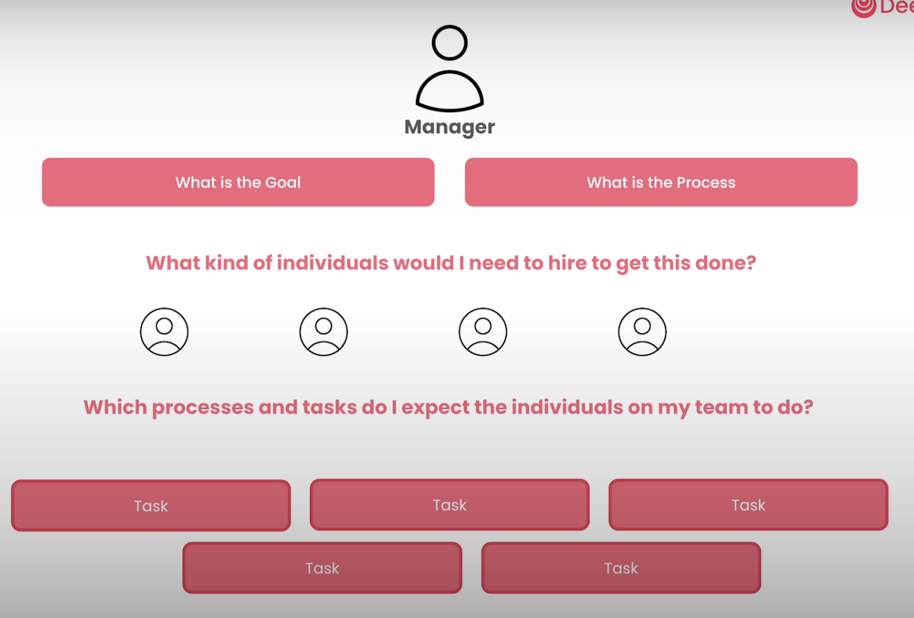

## Tasks

#### Which processes and tasks do i expect the individuals on my team to do?

1. a clear description of the task
2. set a clear and concise expectation

#### things to consider

- set context
- set a callback
- override Agent tools with specific task tools
- force human input before end of task
- execute asynch
- output as json
- output as file
- run in parallel
