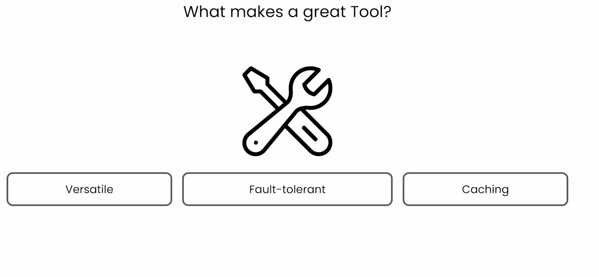
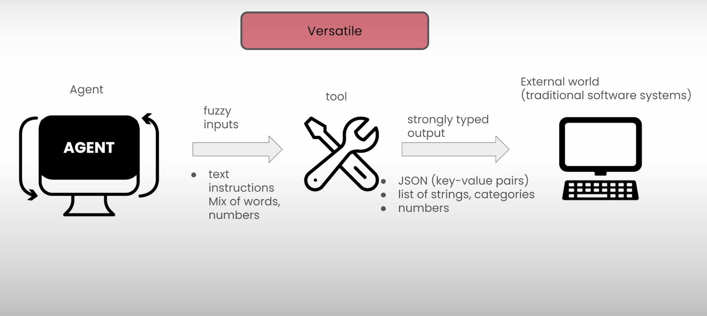
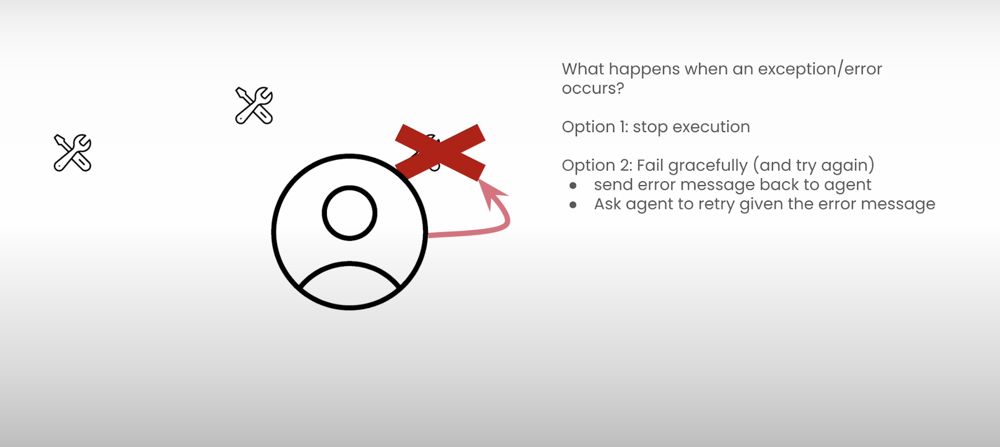
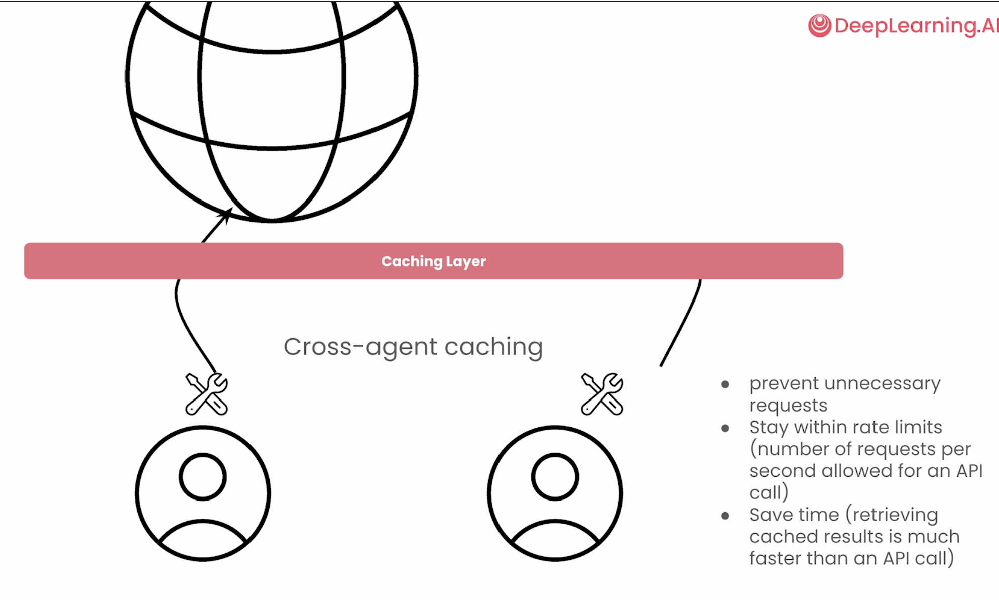
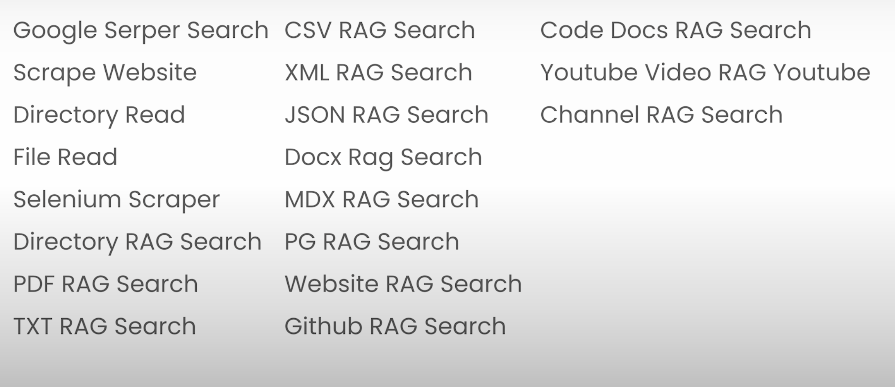

## Tools

its important to keep the tools versatile, fault-tolerant and that they use caching.

Versatile

Fault Tolerant

Caching

Example of Tools:

- search the internet
- Scrape a website
- connect to a database
- call an API
- send notifications

CrewAI can use all Langchain Tools!

out of the box tools:

